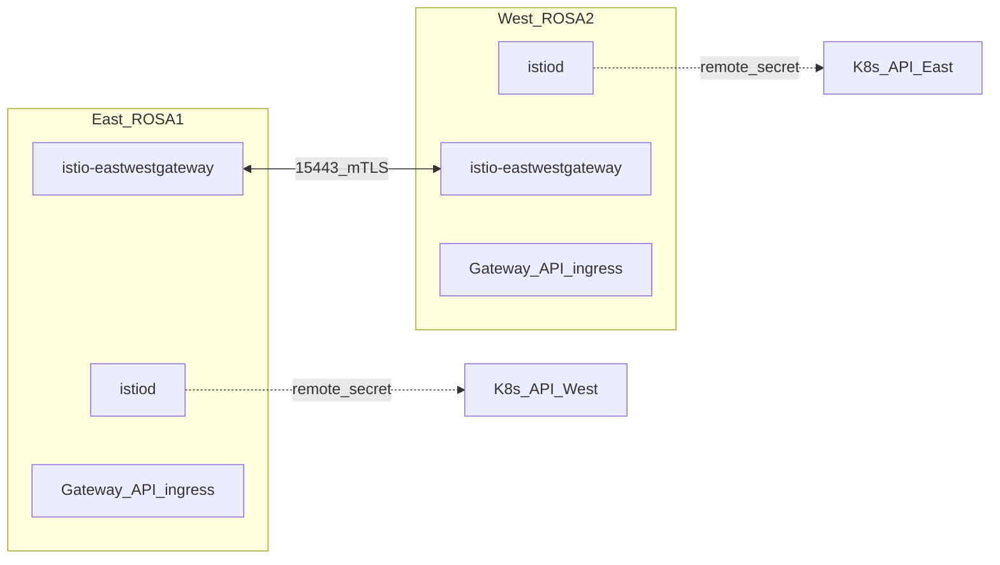

# OSSM 3.3 — Multi-cluster mesh provisioning (two ROSA clusters)

This document is the **infrastructure** runbook: **OpenShift Service Mesh 3.3** on **two ROSA clusters** in a **multi-primary, multi-network** layout. It covers operators and **Istio CNI**, mesh **PKI** and **`cacerts`**, **`Istio` / istiod** on each cluster, **east–west gateways** and **`expose-services`**, **remote secrets** (API access between clusters, including the ROSA TLS note), and **north–south ingress** using the **Kubernetes Gateway API** with **`gatewayClassName: istio`** on **East and West** so each mesh edge has an external entry point **separate from `istio-eastwestgateway`**.

**Sample applications, in-mesh verification curls, HTTPRoute rules to backends, and app namespace cleanup** live in [ossm-mesh-applications-and-routing.md](ossm-mesh-applications-and-routing.md).

**Official documentation**

- Multi-cluster (Chapter 6): [Multi-cluster topologies](https://docs.redhat.com/en/documentation/red_hat_openshift_service_mesh/3.3/html/installing/ossm-multi-cluster-topologies)
- Operator / CNI: [Installing OpenShift Service Mesh](https://docs.redhat.com/en/documentation/red_hat_openshift_service_mesh/3.3/html/installing/ossm-installing-service-mesh)
- Ingress (Gateway API, sidecar): [Gateways](https://docs.redhat.com/en/documentation/red_hat_openshift_service_mesh/3.3/html/gateways/ossm-gateways)

**Topology**


| Cluster   | Role                           | Control plane               |
| --------- | ------------------------------ | --------------------------- |
| **ROSA1** | East / `cluster1` / `network1` | **`Istio` CR** + **istiod** |
| **ROSA2** | West / `cluster2` / `network2` | **`Istio` CR** + **istiod** |


Each cluster runs its own istiod. **Namespace layout (this repo):** **`istio-system`** — control plane only (**istiod**, **`cacerts`**, multicluster remote secrets). **`istio-eastwest`** — **`istio-eastwestgateway`** and **`networking.istio.io` `Gateway`** **`cross-network-gateway`** for cross-cluster **15443**. **`istio-ingress`** — Kubernetes **Gateway API** north–south (**`Gateway` `public-ingress`**, **`HTTPRoute`**, **`httpbin`**). **Remote secrets** let each control plane read the other Kubernetes API. **East–west gateways** terminate cross-network mesh mTLS. **Ingress** (Gateway API) uses a **different** workload than east–west—do not reuse or repoint `istio-eastwestgateway` for north–south.



**Why multi-primary instead of primary-remote?** The primary-remote topology (§ 6.4) creates an ExternalName service for istiod on the remote cluster. On ROSA, that can break sidecar injection because the API server may not reach admission webhooks through ExternalName services. Multi-primary gives every cluster a real local istiod.


| Topic                                             | Red Hat                    | This document                                             |
| ------------------------------------------------- | -------------------------- | --------------------------------------------------------- |
| Topology overview                                 | § 6.1                      | Intro above                                               |
| Creating mesh certificates                        | § 6.2.1                    | § 3                                                       |
| Applying **`cacerts`**                            | § 6.2.2                    | § 4                                                       |
| Multi-primary install (control plane + east–west) | § 6.3                      | § 5–9                                                     |
| Operator / **Istio CNI**                          | Installing guide           | § 1b                                                      |
| North–south Gateway API                           | Gateways                   | § 10–11                                                   |
| Sample workloads / routing                        | § 6.3.1 (verify with apps) | [Applications doc](ossm-mesh-applications-and-routing.md) |

**Table of contents:** [§1 Prerequisites](#1-prerequisites) · [§1b Operator + Istio CNI](#1b-install-the-red-hat-openshift-service-mesh-operator-and-istio-cni-both-clusters) · [§1c Console banner (optional)](#1c-optional-console-notification-which-cluster-am-i-in) · [§2 `ISTIO_VERSION`](#2-istio_version-local-workstation) · [§3–4 PKI / `cacerts`](#3-pki--creating-certificates-red-hat-621) · [§5–8 Istio + east–west](#5-istio-on-rosa1-east--run-on-east) · [§9 Remote secrets](#9-rbac--remote-secrets-bidirectional) · [§10–11 Ingress](#10-northsouth-ingress--gateway-api-on-east-rosa1) · [Appendix A](#appendix-a-eastwest-network-connectivity-checks) · [Appendix B](#appendix-b-troubleshooting)

**How to read command blocks:** Each subsection names the cluster it applies to—**Run on: East** (ROSA1) or **Run on: West** (ROSA2). Use `oc` (and other CLIs) against **that** cluster in whatever way you already do: `oc login`, OpenShift contexts, your IDE, automation, and so on. This document does **not** require specific kubeconfig file paths or shell variables.


| Label    | Cluster (this PoC)              |
| -------- | ------------------------------- |
| **East** | ROSA1 — `cluster1` / `network1` |
| **West** | ROSA2 — `cluster2` / `network2` |


**`istioctl` and two clusters:** In § 9, some commands `istioctl create-remote-secret --kubeconfig=…` must read API credentials for one cluster while **`oc apply`** targets the other. The flag name is fixed by the tool; substitute the kubeconfig path (or file your environment generates) that authenticates to the cluster named in the surrounding text.

**Demo parameter file (reuse across runs):** Copy [`config/demo-params.example.yaml`](../config/demo-params.example.yaml) to **`config/demo-params.yaml`** (ignored by Git) and set mesh labels (`cluster_name`, `network`, `mesh.id`), ingress hostnames, Istio version, and optional OpenShift API URLs for your own reference. Never commit **tokens** or credential **files**.

**Mapping `demo-params.yaml` → this runbook**

| YAML path | Used for |
| --------- | -------- |
| `demo.istio.version` | § 2 `ISTIO_VERSION`; **`Istio`** / **`IstioCNI`** `spec.version` as `v<version>` (§ 1b, § 5–7). |
| `demo.mesh.id` | **`Istio`** `values.global.meshID` — **same on both clusters**. |
| `demo.clusters.east.cluster_name` / `network` | East **`Istio`** `multiCluster.clusterName` and `global.network`. |
| `demo.clusters.west.cluster_name` / `network` | West **`Istio`**. |
| `demo.ingress.east.*` / `demo.ingress.west.*` | § 10–11; namespaces **`istio-ingress`**, gateway **`public-ingress`**. |
| `demo.eastwest.*` | § 6–8; **`istio-eastwest`** / **`istio-eastwestgateway`**. |
| `demo.applications.sample_namespace` | [Applications doc](ossm-mesh-applications-and-routing.md). |
| `demo.pki.workstation_dir` | § 3–4 OpenSSL working directory. |
| Console banner text / colors | Edit [`manifests/console/east-console-notification.yaml`](../manifests/console/east-console-notification.yaml) and [`manifests/console/west-console-notification.yaml`](../manifests/console/west-console-notification.yaml) so labels match `demo.clusters.*` (optional § 1c). |

---

## 1) Prerequisites

1. Two ROSA clusters; **admin** access on both.
2. **OSSM 3.x** operator and **Istio CNI** on **both** clusters — installed per **[§ 1b](#1b-install-the-red-hat-openshift-service-mesh-operator-and-istio-cni-both-clusters)** (or the Red Hat console workflow in the same guide).
3. `istioctl` installed locally, aligned with `ISTIO_VERSION` — **1.28.5** for this PoC (see § 2).
4. **LoadBalancers** in ROSA for `istio-eastwestgateway` on **both** clusters (ROSA normally provides this).
5. **Network:** Each cluster must be able to reach the other's east-west gateway LoadBalancer on ports **15443** (cross-network mTLS). Each **istiod** must reach the other cluster's Kubernetes API (remote secret). See [Appendix A](#appendix-a-eastwest-network-connectivity-checks).
6. **Order:** § 1b → § 2–4 (PKI + `cacerts`) → § 5+ (`Istio` CR). For console-first operator install or non-default channels, follow the [installing guide](https://docs.redhat.com/en/documentation/red_hat_openshift_service_mesh/3.3/html/installing/ossm-installing-service-mesh).

**Optional automation:** from the repo root, with **`KUBECONFIG_EAST`** and **`KUBECONFIG_WEST`** set to valid kubeconfigs, **[`scripts/day1-deploy.sh`](../scripts/day1-deploy.sh)** runs **§1b–§9** (operator, CNI, PKI, `cacerts`, `Istio`, east–west, ROSA remote-secret patch). See **[README.md](../README.md#automated-day-1-scriptsday1-deploysh)** for flags and prerequisites.

---

## 1b) Install the Red Hat OpenShift Service Mesh Operator and Istio CNI (both clusters)

Repeat **everything in this section** on **East**, then again on **West**. Official background: [Installing OpenShift Service Mesh — ch. 2](https://docs.redhat.com/en/documentation/red_hat_openshift_service_mesh/3.3/html/installing/ossm-installing-service-mesh) (operator, `Istio`, `IstioCNI` projects).

### 1b.1 Confirm OpenShift and discover the package name

```bash
oc version
oc get packagemanifest -n openshift-marketplace | grep -i servicemesh
```

Use the **PackageManifest `NAME`** that corresponds to **OpenShift Service Mesh 3** on your cluster (often `servicemeshoperator3`). If the name differs, substitute it below as `spec.name` and in `oc get csv` filters.

### 1b.2 Install the operator (Subscription)

Create a **Subscription** in **`openshift-operators`**. Adjust **`spec.channel`** and **`metadata.name` / `spec.name`** if your `PackageManifest` name differs.

```bash
cat <<'EOF' | oc apply -f -
apiVersion: operators.coreos.com/v1alpha1
kind: Subscription
metadata:
  name: servicemeshoperator3
  namespace: openshift-operators
spec:
  channel: stable
  installPlanApproval: Automatic
  name: servicemeshoperator3
  source: redhat-operators
  sourceNamespace: openshift-marketplace
EOF
```

### 1b.3 Wait for the operator CSV

```bash
oc get csv -n openshift-operators -w
```

Stop when the **OpenShift Service Mesh** ClusterServiceVersion shows **Succeeded** (Ctrl+C). Quick check:

```bash
oc get csv -n openshift-operators | grep -i servicemesh
oc get pods -n openshift-operators | grep -i servicemesh
```

### 1b.4 Create the Istio CNI project and `IstioCNI` resource

Red Hat deploys the CNI plugin to a **dedicated** project (here **`istio-cni`**). Set **`spec.version`** to **`v${ISTIO_VERSION}`** (same line as § 2, e.g. `v1.28.5`).

```bash
oc get project istio-cni || oc new-project istio-cni
```

```bash
cat <<EOF | oc apply -f -
apiVersion: sailoperator.io/v1
kind: IstioCNI
metadata:
  name: default
  namespace: istio-cni
spec:
  version: v${ISTIO_VERSION}
EOF
```

### 1b.5 Verify operator + CNI (checkpoint)

```bash
oc get crd istios.sailoperator.io
oc api-resources --api-group=sailoperator.io
oc get istiocni -n istio-cni
oc describe istiocni default -n istio-cni
oc get pods -n istio-cni
```

Expect **`IstioCNI`** to reach a **healthy** / **ready** state (see **Status** in `oc describe`). CNI **Pods** should be **Running**. If `istiocni` is not a recognized resource, use the exact kind from `oc api-resources --api-group=sailoperator.io`.

**Workstation tools (for § 9c):** install **`python3`** and **PyYAML** (e.g. Fedora `sudo dnf install python3-pyyaml`, or `pip install pyyaml` in a venv).

**Do not** create the **`Istio`** control-plane CR here unless you have already applied **`cacerts`** per your security process—this PoC applies **`cacerts`** in § 4, then **`Istio`** in § 5–7.

---

## 1c) Optional: Console notification (which cluster am I in?)

OpenShift can show a **banner** on every console page via **`ConsoleNotification`** (`console.openshift.io/v1`). For two clusters that look alike, apply **one** manifest **per** cluster so the banner text matches the cluster you are logged into.

**Run on: East** (after you can reach the console as **cluster-admin**):

```bash
oc apply -f manifests/console/east-console-notification.yaml
```

**Run on: West:**

```bash
oc apply -f manifests/console/west-console-notification.yaml
```

Edit **`spec.text`** (and optional **`backgroundColor`** / **`color`**) in each file if your **`cluster_name`** / **`network`** values differ from the defaults in [`config/demo-params.example.yaml`](../config/demo-params.example.yaml). Set **`spec.location`** to **`BannerTop`**, **`BannerBottom`**, or **`BannerTopBottom`** if you prefer another placement.

Verify:

```bash
oc get consolenotification
```

---

## 2) `ISTIO_VERSION` (local workstation)

Set this on the machine where you run **`istioctl`** and heredocs that reference `v${ISTIO_VERSION}`.

This PoC targets **Istio 1.28.5** (OSSM 3.3.1 operator). Use **no** leading `v` in the variable; the `Istio` CR uses `version: v${ISTIO_VERSION}` → `v1.28.5` (§ 5–7).

```bash
export ISTIO_VERSION=1.28.5
```

- **Operator sanity check:** OSSM **3.3.x** ships Istio 1.28. If your operator channel differs, match `ISTIO_VERSION` / `istioctl` to that version, not this file.
- **After the `Istio` CR exists** on either cluster (**Run on: East** or **West**, wherever you check):

```bash
oc get istio
oc get istio default -o jsonpath='{.spec.version}{"\n"}'
```

- `istioctl version --remote=false` should match the same Istio minor line.

---

## 3) PKI — Creating certificates (Red Hat § 6.2.1)

Run everything below on a **secure workstation** with **OpenSSL** installed (not on the clusters). **Protect** `root-key.pem`, `east/ca-key.pem`, and `west/ca-key.pem`; they are signing keys.

Official procedure: **§ 6.2.1. Creating certificates for a multi-cluster topology** in Chapter 6.

Working directory: create and use a dedicated folder (for example `~/ossm-mesh-certs`).

### 3.1 Root CA

```bash
openssl genrsa -out root-key.pem 4096
```

Create `root-ca.conf` in the same directory with this content:

```ini
encrypt_key = no
prompt = no
utf8 = yes
default_md = sha256
default_bits = 4096
req_extensions = req_ext
x509_extensions = req_ext
distinguished_name = req_dn
[ req_ext ]
subjectKeyIdentifier = hash
basicConstraints = critical, CA:true
keyUsage = critical, digitalSignature, nonRepudiation, keyEncipherment, keyCertSign
[ req_dn ]
O = Istio
CN = Root CA
```

Then:

```bash
openssl req -sha256 -new -key root-key.pem \
  -config root-ca.conf \
  -out root-cert.csr

openssl x509 -req -sha256 -days 3650 \
  -signkey root-key.pem \
  -extensions req_ext -extfile root-ca.conf \
  -in root-cert.csr \
  -out root-cert.pem
```

### 3.2 Intermediate CA for **East** cluster (ROSA1)

Red Hat calls this **East**; files go under `east/`.

```bash
mkdir east
openssl genrsa -out east/ca-key.pem 4096
```

Create `east/intermediate.conf`:

```ini
[ req ]
encrypt_key = no
prompt = no
utf8 = yes
default_md = sha256
default_bits = 4096
req_extensions = req_ext
x509_extensions = req_ext
distinguished_name = req_dn
[ req_ext ]
subjectKeyIdentifier = hash
basicConstraints = critical, CA:true, pathlen:0
keyUsage = critical, digitalSignature, nonRepudiation, keyEncipherment, keyCertSign
subjectAltName=@san
[ san ]
DNS.1 = istiod.istio-system.svc
[ req_dn ]
O = Istio
CN = Intermediate CA
L = east
```

Then:

```bash
openssl req -new -config east/intermediate.conf \
  -key east/ca-key.pem \
  -out east/cluster-ca.csr

openssl x509 -req -sha256 -days 3650 \
  -CA root-cert.pem \
  -CAkey root-key.pem -CAcreateserial \
  -extensions req_ext -extfile east/intermediate.conf \
  -in east/cluster-ca.csr \
  -out east/ca-cert.pem

cat east/ca-cert.pem root-cert.pem > east/cert-chain.pem && cp root-cert.pem east
```

### 3.3 Intermediate CA for **West** cluster (ROSA2)

Red Hat calls this **West**; files go under `west/`.

```bash
mkdir west
openssl genrsa -out west/ca-key.pem 4096
```

Create `west/intermediate.conf` (same as East except `L = west`):

```ini
[ req ]
encrypt_key = no
prompt = no
utf8 = yes
default_md = sha256
default_bits = 4096
req_extensions = req_ext
x509_extensions = req_ext
distinguished_name = req_dn
[ req_ext ]
subjectKeyIdentifier = hash
basicConstraints = critical, CA:true, pathlen:0
keyUsage = critical, digitalSignature, nonRepudiation, keyEncipherment, keyCertSign
subjectAltName=@san
[ san ]
DNS.1 = istiod.istio-system.svc
[ req_dn ]
O = Istio
CN = Intermediate CA
L = west
```

Then:

```bash
openssl req -new -config west/intermediate.conf \
  -key west/ca-key.pem \
  -out west/cluster-ca.csr

openssl x509 -req -sha256 -days 3650 \
  -CA root-cert.pem \
  -CAkey root-key.pem -CAcreateserial \
  -extensions req_ext -extfile west/intermediate.conf \
  -in west/cluster-ca.csr \
  -out west/ca-cert.pem

cat west/ca-cert.pem root-cert.pem > west/cert-chain.pem && cp root-cert.pem west
```

### 3.4 Files you need for the next section


| Cluster      | Directory | Used in `cacerts` secret                                       |
| ------------ | --------- | -------------------------------------------------------------- |
| ROSA1 (East) | `east/`   | `ca-cert.pem`, `ca-key.pem`, `root-cert.pem`, `cert-chain.pem` |
| ROSA2 (West) | `west/`   | `ca-cert.pem`, `ca-key.pem`, `root-cert.pem`, `cert-chain.pem` |

### Verification (checkpoint — § 3)

On the workstation where you generated the PKI:

```bash
for d in east west; do
  echo "== $d =="
  ls -l "$d"/ca-cert.pem "$d"/ca-key.pem "$d"/root-cert.pem "$d"/cert-chain.pem
done
```

Expect **four** files per directory. Optionally compare checksums before applying **§ 4** (same files on disk as you intend to upload).

---

## 4) Applying certificates (Red Hat § 6.2.2)

Official procedure: **§ 6.2.2. Applying certificates to a multi-cluster topology**.

Run `oc create secret` from the directory that contains the `east/` and `west/` folders (or use full paths in `--from-file`).

### Run on: East — (`network1`, east certs)

```bash
oc get project istio-system || oc new-project istio-system
oc label namespace istio-system topology.istio.io/network=network1 --overwrite
```

**PKI sanity (workstation, before `cacerts`):** `east/root-cert.pem` and `west/root-cert.pem` must be **the same bytes** (per § 3.3, `root-cert.pem` is copied into both trees). Quick check:

```bash
sha256sum east/root-cert.pem west/root-cert.pem
```

Two **different** hashes here mean multi-cluster trust will break.

**Installing or replacing `cacerts`:** The pattern `oc get secret cacerts || oc create ...` only creates the secret when it is **missing**. If `cacerts` already exists from an old operator install or the wrong folder, the command **skips** your PEMs and East/West roots will **not** match. If you need to **replace** the secret, delete it first (only in a controlled PoC window — istiod may restart):

```bash
oc delete secret cacerts -n istio-system
```

Then:

```bash
oc get secret -n istio-system cacerts || \
oc create secret generic cacerts -n istio-system \
  --from-file=east/ca-cert.pem \
  --from-file=east/ca-key.pem \
  --from-file=east/root-cert.pem \
  --from-file=east/cert-chain.pem
```

### Run on: West — (`network2`, west certs)

```bash
oc get project istio-system || oc new-project istio-system
oc label namespace istio-system topology.istio.io/network=network2 --overwrite
```

Same rule: if `cacerts` exists and is wrong, `oc delete secret cacerts -n istio-system`, then:

```bash
oc get secret -n istio-system cacerts || \
oc create secret generic cacerts -n istio-system \
  --from-file=west/ca-cert.pem \
  --from-file=west/ca-key.pem \
  --from-file=west/root-cert.pem \
  --from-file=west/cert-chain.pem
```

**After both clusters have `cacerts` from this PoC's PKI**, confirm the **same root** is on the clusters (hashes must match):

```bash
# Run on: East
oc get secret cacerts -n istio-system -o jsonpath='{.data.root-cert\.pem}' | base64 -d | sha256sum
# Run on: West
oc get secret cacerts -n istio-system -o jsonpath='{.data.root-cert\.pem}' | base64 -d | sha256sum
```

### Verification (checkpoint — § 4)

- **Same root on both clusters:** the two `sha256sum` lines must be **identical**.
- **Secret present:** `oc get secret cacerts -n istio-system` on **East** and **West**.
- **Network labels:** `oc get ns istio-system --show-labels` shows `topology.istio.io/network=network1` (East) or `network2` (West).

Red Hat **Next steps:** continue with **§ 6.3** in **§ 5** onward.

---

## 5) `Istio` on ROSA1 (East) — **Run on: East**

Official **§ 6.3** — *Install Istio on the East cluster*.

Unlike primary-remote, there is **no** `externalIstiod: true` flag. Both clusters get a standard Istio CR.

```bash
cat <<EOF | oc apply -f -
apiVersion: sailoperator.io/v1
kind: Istio
metadata:
  name: default
spec:
  version: v${ISTIO_VERSION}
  namespace: istio-system
  values:
    global:
      meshID: mesh1
      multiCluster:
        clusterName: cluster1
      network: network1
EOF
```

```bash
oc wait --for=condition=Ready istio/default --timeout=3m
```

### Verification (checkpoint — § 5)

```bash
oc get istio default -n istio-system -o wide
oc get pods -n istio-system -l app=istiod
oc get deploy,svc -n istio-system | grep -E 'istiod|NAME'
```

- **`Istio`** condition **Ready** = **True** (from `oc wait` above).
- **`istiod`** **Deployment** available (1+ ready replicas).
- No crash-looping pods in **`istio-system`**.

---

## 6) ROSA1 — east-west gateway + expose services — **Run on: East**

Deploy east–west gateway workloads in **`istio-eastwest`** (not **`istio-system`**) so the control-plane namespace stays reserved for **istiod**. The bundle includes **`cross-network-gateway`** in the same namespace (required so the Istio `Gateway` selector matches the gateway pods). Manifests: [`manifests/istio-eastwest/cluster1/`](../manifests/istio-eastwest/cluster1/). If you previously applied upstream sail-operator YAML into **`istio-system`**, delete the old east–west **Deployment**/**Service**/**Gateway** there before applying this.

```bash
oc apply -k manifests/istio-eastwest/cluster1/
```

Wait for the gateway to get an external address:

```bash
oc -n istio-eastwest get svc istio-eastwestgateway -w
```

(Ctrl+C once **`EXTERNAL-IP`** or hostname is set for **`istio-eastwestgateway`**.)

### Verification (checkpoint — § 6)

```bash
oc -n istio-eastwest get svc istio-eastwestgateway
oc -n istio-eastwest get deploy -l istio=eastwestgateway
```

- **Service** has **`EXTERNAL-IP`** or cloud hostname (ROSA LoadBalancer).
- **Deployment** for the east–west gateway is **Available**.

Record the east–west **hostname or IP** for [Appendix A](#appendix-a-eastwest-network-connectivity-checks).

---

## 7) `Istio` on ROSA2 (West) — **Run on: West**

Official **§ 6.3** — *Install Istio on the West cluster*.

The West Istio CR is a standard installation (same structure as East), **not** a remote profile. It runs its own istiod.

```bash
cat <<EOF | oc apply -f -
apiVersion: sailoperator.io/v1
kind: Istio
metadata:
  name: default
spec:
  version: v${ISTIO_VERSION}
  namespace: istio-system
  values:
    global:
      meshID: mesh1
      multiCluster:
        clusterName: cluster2
      network: network2
EOF
```

```bash
oc wait --for=condition=Ready istio/default --timeout=3m
```

### Verification (checkpoint — § 7)

Same checks as § 5 (**Run on: West**): `oc get istio`, `istiod` pods, deployments in **`istio-system`**.

---

## 8) ROSA2 — east-west gateway + expose services — **Run on: West**

Same as § 6 using [`manifests/istio-eastwest/cluster2/`](../manifests/istio-eastwest/cluster2/) (**network2**). Remove legacy east–west objects from **`istio-system`** if migrating.

```bash
oc apply -k manifests/istio-eastwest/cluster2/
```

```bash
oc -n istio-eastwest get svc istio-eastwestgateway
```

### Verification (checkpoint — § 8)

Same as § 6 (**Run on: West**): east–west **Service** has external address; **Deployment** available.

---

## 9) RBAC + Remote secrets (bidirectional)

Most `oc` steps below are labeled **Run on: East** or **Run on: West**. For `istioctl create-remote-secret`, the `--kubeconfig` argument must point at the cluster **being read** (see § 9b).

In multi-primary, **both** istiods need to watch the other cluster's API server. This requires:

1. A `istio-reader-service-account` service account in `istio-system` on each cluster (the operator typically creates this when deploying istiod).
2. The `cluster-reader` role bound to that SA on each cluster.
3. A remote secret from each cluster applied to the other, using `--create-service-account=false` since the SA already exists.

### 9a) Create service accounts and RBAC

The Sail Operator usually creates `istio-reader-service-account` in `istio-system` when it deploys istiod. If not, create it manually:

**Run on: East**

```bash
oc create serviceaccount istio-reader-service-account -n istio-system 2>/dev/null || true
oc adm policy add-cluster-role-to-user cluster-reader -z istio-reader-service-account -n istio-system
```

**Run on: West**

```bash
oc create serviceaccount istio-reader-service-account -n istio-system 2>/dev/null || true
oc adm policy add-cluster-role-to-user cluster-reader -z istio-reader-service-account -n istio-system
```

### 9b) Remote secrets

`istioctl create-remote-secret` must read the cluster you export credentials **from**; **`oc apply`** in the same pipeline targets whichever cluster your **`oc`** client is currently pointed at. Use `--kubeconfig=…` with the file (or generated secret) that authenticates to the **named** cluster.

Pass **`-n istio-system`** (and **`-i istio-system`**) to **`istioctl`** so it reads the **`istio-reader-service-account`** in **`istio-system`**; otherwise the tool may look in **`default`** and fail with `istio-reader-service-account.default` not found.

Before `istioctl create-remote-secret`, you may also set the kubeconfig **current context** namespace (optional if you use **`-n`**):

With **`oc`** pointed at the cluster **`istioctl` is about to read** (e.g. **West** first), run:

```bash
oc config set-context --current --namespace=istio-system
```

Repeat with **`oc`** pointed at **East** before generating the secret that reads East.

**Remote secret from West → apply on East**

- Point **`oc`** at **East**.
- Pass **`istioctl`** credentials for **West** via `--kubeconfig` (path or file your environment uses for West).

```bash
istioctl create-remote-secret \
  --kubeconfig=/path/to/kubeconfig-for-west-cluster \
  -n istio-system \
  -i istio-system \
  --name=cluster2 \
  --create-service-account=false | \
  oc apply -f -
```

**Remote secret from East → apply on West**

- Point **`oc`** at **West**.
- Pass **`istioctl`** credentials for **East**.

```bash
istioctl create-remote-secret \
  --kubeconfig=/path/to/kubeconfig-for-east-cluster \
  -n istio-system \
  -i istio-system \
  --name=cluster1 \
  --create-service-account=false | \
  oc apply -f -
```

### 9c) ROSA-specific: TLS fix for remote secrets

On ROSA, `istioctl create-remote-secret` embeds a `certificate-authority-data` in the kubeconfig that does not match the ROSA API endpoint's actual TLS certificate chain (the embedded CA is the OpenShift internal CA, but the ROSA API serves Let's Encrypt certificates). The istiod container (distroless) has no system CA bundle and relies solely on the embedded CA, causing `x509: certificate signed by unknown authority` errors.

**Fix for PoC:** Post-process each remote secret to replace `certificate-authority-data` with `insecure-skip-tls-verify: true`. This is acceptable for a PoC environment.

Instead of piping directly to `oc apply`, save the raw output, fix it with a script, then apply:

```bash
# Generate raw secret (istioctl reads West; use your West kubeconfig path)
istioctl create-remote-secret \
  --kubeconfig=/path/to/kubeconfig-for-west-cluster \
  -n istio-system \
  -i istio-system \
  --name=cluster2 \
  --create-service-account=false > /tmp/remote-secret-raw.yaml

# Fix TLS and namespace
python3 <<'PYEOF'
import yaml, base64, sys

with open("/tmp/remote-secret-raw.yaml") as f:
    docs = list(yaml.safe_load_all(f))

secret_doc = next((d for d in docs if d and d.get("kind") == "Secret"), None)
if not secret_doc:
    sys.exit("ERROR: No Secret found in istioctl output")

if secret_doc.get("metadata", {}).get("namespace") == "default":
    secret_doc["metadata"]["namespace"] = "istio-system"

kc_key = "cluster2"
if "stringData" in secret_doc and kc_key in secret_doc["stringData"]:
    kc_yaml = secret_doc["stringData"][kc_key]
    is_string_data = True
elif "data" in secret_doc and kc_key in secret_doc["data"]:
    kc_yaml = base64.b64decode(secret_doc["data"][kc_key]).decode()
    is_string_data = False
else:
    sys.exit("ERROR: Cannot find " + kc_key + " key in secret")

kc = yaml.safe_load(kc_yaml)
for cluster in kc.get("clusters", []):
    cfg = cluster.get("cluster", {})
    cfg.pop("certificate-authority-data", None)
    cfg["insecure-skip-tls-verify"] = True

fixed = yaml.dump(kc, default_flow_style=False)
if is_string_data:
    secret_doc["stringData"][kc_key] = fixed
else:
    secret_doc["data"][kc_key] = base64.b64encode(fixed.encode()).decode()

with open("/tmp/remote-secret-fixed.yaml", "w") as f:
    yaml.dump(secret_doc, f, default_flow_style=False)
PYEOF

# Apply to East (oc aimed at East)
oc apply -f /tmp/remote-secret-fixed.yaml
```

Repeat the same process for the East → West secret, changing `kc_key` to `"cluster1"`, regenerating with `istioctl --kubeconfig=/path/to/kubeconfig-for-east-cluster`, and applying while **oc** aims at **West**.

### Verification (checkpoint — § 9)

**Remote secrets:**

```bash
# Run on: East
oc get secret -n istio-system -l istio/multiCluster=true
# Run on: West
oc get secret -n istio-system -l istio/multiCluster=true
```

**istiod logs** (expect **no** lines, or investigate if `x509` / `forbidden` appears):

```bash
# Run on: East
oc logs deploy/istiod -n istio-system | grep -i 'x509.*failed\|forbidden' | tail -5
# Run on: West
oc logs deploy/istiod -n istio-system | grep -i 'x509.*failed\|forbidden' | tail -5
```

---

## 10) North–south ingress — Gateway API on **East** (ROSA1)

After § 9, add **public** north–south entry in **`istio-ingress`** using the **Kubernetes Gateway API** with **`spec.gatewayClassName: istio`** (not `networking.istio.io/Gateway`). Istio creates **`public-ingress-istio`** **Deployment**/**Service** there—separate from **`istio-eastwestgateway`** (**`istio-eastwest`**) and **istiod** (**`istio-system`**).

**Manifests:** [`manifests/east/`](../manifests/east/) — **`Namespace` `istio-ingress`**, **`Gateway` `public-ingress`**, **`httpbin`**, **`HTTPRoute`**. Listener hostname **`east-ingress.example.com`** (edit YAML if yours differs).

**Run on: East**

```bash
oc get gatewayclass istio
oc apply -k manifests/east/
oc apply -f manifests/sample/referencegrant-istio-ingress.yaml
oc wait --for=condition=programmed "gtw/public-ingress" -n istio-ingress --timeout=3m
```

If **`public-ingress-istio`** is **ClusterIP**, expose it (ROSA often sets **LoadBalancer** automatically):

```bash
oc patch svc public-ingress-istio -n istio-ingress -p '{"spec":{"type":"LoadBalancer"}}'
```

```bash
oc get gtw public-ingress -n istio-ingress -o jsonpath='{.status.addresses[0].value}{"\n"}'
export INGRESS_HOST=$(oc get gtw public-ingress -n istio-ingress -o jsonpath='{.status.addresses[0].value}')
curl -sI -H 'Host: east-ingress.example.com' "http://${INGRESS_HOST}/headers"
```

### Verification (checkpoint — § 10)

```bash
oc get gtw public-ingress -n istio-ingress
oc get deploy,svc -n istio-ingress
```

- **`Gateway`** condition **Programmed** = **True**.
- **`public-ingress-istio`** **Service** has an external hostname or IP when using a cloud LB.

Use **one path (or match set) per `HTTPRoute` rule**—multiple `matches` in the **same** rule are **AND**ed. TLS, Routes, and advanced options: [Gateways guide](https://docs.redhat.com/en/documentation/red_hat_openshift_service_mesh/3.3/html/gateways/ossm-gateways).

**Cross-namespace backends** (e.g. `helloworld` in **`sample`**) need a **`ReferenceGrant`**—see [applications doc](ossm-mesh-applications-and-routing.md) § 4.

---

## 11) North–south ingress — Gateway API on **West** (ROSA2)

**Run on: West** — same layout as § 10: **`istio-ingress`** / **`Gateway` `public-ingress`**, listener hostname **`west-ingress.example.com`** ([`manifests/west/`](../manifests/west/)). Apply the **`ReferenceGrant`** when using **`/hello`** → **`sample/helloworld`** (same manifest as East).

```bash
oc get gatewayclass istio
oc apply -k manifests/west/
oc apply -f manifests/sample/referencegrant-istio-ingress.yaml
oc wait --for=condition=programmed "gtw/public-ingress" -n istio-ingress --timeout=3m
```

If **`public-ingress-istio`** is **ClusterIP**:

```bash
oc patch svc public-ingress-istio -n istio-ingress -p '{"spec":{"type":"LoadBalancer"}}'
```

```bash
export INGRESS_HOST=$(oc get gtw public-ingress -n istio-ingress -o jsonpath='{.status.addresses[0].value}')
curl -sI -H 'Host: west-ingress.example.com' "http://${INGRESS_HOST}/headers"
```

### Verification (checkpoint — § 11)

Same as § 10: namespace **`istio-ingress`**, gateway **`public-ingress`**.

Do **not** repoint **`istio-eastwestgateway`** for north–south; east–west stays on **15443**.

---

## Appendix A — East–west network connectivity checks

Use the **external hostnames** (or IPs) of **`istio-eastwestgateway`** **Service** in **`istio-eastwest`** from § 6 (East) and § 8 (West).

**From a host that can reach both clouds** (laptop on correct network, jump host, or a pod in one cluster with outbound access):

```bash
# Replace with your east-west ELB hostnames
EAST_EW=istio-eastwestgateway.example-east.com
WEST_EW=istio-eastwestgateway.example-west.com
nc -vz "$EAST_EW" 15443
nc -vz "$WEST_EW" 15443
```

Optional TLS probe:

```bash
openssl s_client -connect "${EAST_EW}:15443" -servername istiod.istio-system.svc </dev/null 2>/dev/null | head -20
```

- **Failure** at this layer (timeout / refused) is a **cloud security group / firewall / routing** issue, not Istio routing.
- **Success** here does not replace verifying **remote secrets** and **istiod** logs in § 9.

---

## Appendix B — Troubleshooting

| Symptom | Where to look |
| ------- | ------------- |
| **`Istio` not Ready** | **Run on:** that cluster — `oc describe istio default -n istio-system`; `oc logs -n istio-system deploy/istiod`; operator logs in `openshift-operators`. |
| **`cacerts` / PKI errors** | § 3–4: matching root hash; replacing an existing secret requires `oc delete secret cacerts -n istio-system` first (PoC only). |
| **Remote secret / `x509: certificate signed by unknown authority`** in **istiod** | § 9c ROSA workaround; ensure **both** directions were post-processed and applied to the **correct** cluster. |
| **`istioctl create-remote-secret` fails** (e.g. `istio-reader-service-account.default` not found) | Reader SA and **cluster-reader** RBAC (§ 9a); add **`-n istio-system`** (and **`-i istio-system`**) to **`istioctl`**. |
| **Gateway** not **Programmed** | `oc describe gtw …`; `oc get deploy,svc` in the ingress namespace; **GatewayClass** `istio` accepted; injection label on namespace. |
| **HTTP 404 from ingress** | **`HTTPRoute`** `parentRefs` / `hostnames` / paths; one **AND**ed `matches` list per rule (see applications doc). |
| **Cross-namespace backend 403/404** | **`ReferenceGrant`** in the **Service’s** namespace ([`manifests/sample/`](../manifests/sample/)). |

**Infrastructure recap:** § 1–11 plus appendices cover two clusters, shared trust, east–west gateways, remote secrets, and optional **East** + **West** Gateway API ingress. **Applications** continue in [ossm-mesh-applications-and-routing.md](ossm-mesh-applications-and-routing.md).